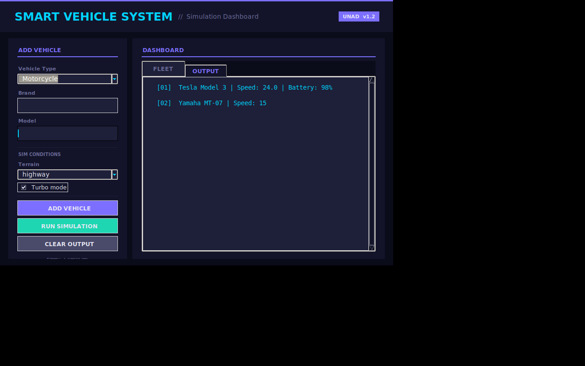
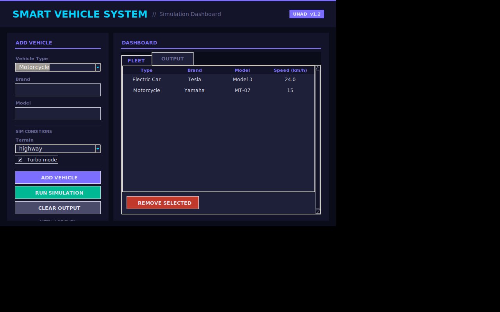

🌐 [English version](README.md) | Español

# 🚗 Smart Vehicle System


**Autor:** Camilo Andrés León Rubriche
**Institución:** Universidad Nacional Abierta y a Distancia — UNAD
**Curso:** Programación

> Simulador de flota de vehículos con interfaz gráfica, construido en Python aplicando herencia, polimorfismo y sobrecarga de métodos.

## Descripción

Sistema que simula distintos tipos de vehículos (auto eléctrico, moto, camión) aplicando conceptos de Programación Orientada a Objetos: herencia, polimorfismo y sobrecarga de métodos. Incluye una interfaz gráfica construida con Tkinter donde se arma una flota y se corre una simulación de aceleración según el terreno y el modo turbo.

## Capturas de pantalla

| Salida de la simulación | Tabla de flota |
|---|---|
|  |  |

## Ejecución

```bash
python Ejercicio_1.py
```

Requisitos: Python 3.10+ (usa únicamente la librería estándar — `tkinter`, `logging`).

## Pruebas

```bash
pip install -r requirements.txt
pytest tests/ -v
```

23 pruebas unitarias cubren la clase base `Vehiculo`, cada subclase (`AutoElectrico`, `Moto`, `Camion`), el polimorfismo en `acelerar()` y el controlador `SistemaVehiculos` (agregar/eliminar/simular flota). Se ejecutan automáticamente en cada push vía GitHub Actions (ver badge arriba).

## Características

- Clase base `Vehiculo` con herencia hacia `AutoElectrico`, `Moto` y `Camion`
- Polimorfismo en el método `acelerar()` según el tipo de vehículo
- Sobrecarga simulada de `acelerar()` mediante parámetros opcionales (`turbo`, `terrain`)
- Interfaz gráfica con tema oscuro (Tkinter + ttk)
- Registro de eventos en `vehicle_log.txt`
- Exportación de resultados de simulación a `simulation_report.txt`

## Arquitectura

```
SmartVehicleSystemV2/
│
├── Ejercicio_1.py             # Aplicación completa: modelos, herencia/polimorfismo y UI (Tkinter)
├── tests/
│   └── test_vehiculos.py       # Pruebas unitarias (pytest)
├── .github/workflows/
│   └── tests.yml                # CI: corre las pruebas en cada push
├── requirements.txt
├── LICENSE
├── vehicle_log.txt               # Log de eventos (se genera en ejecución)
└── simulation_report.txt          # Reporte exportado de la última simulación (se genera en ejecución)
```

## Tecnologías

- Python 3
- tkinter / ttk — interfaz gráfica
- logging — registro de eventos
